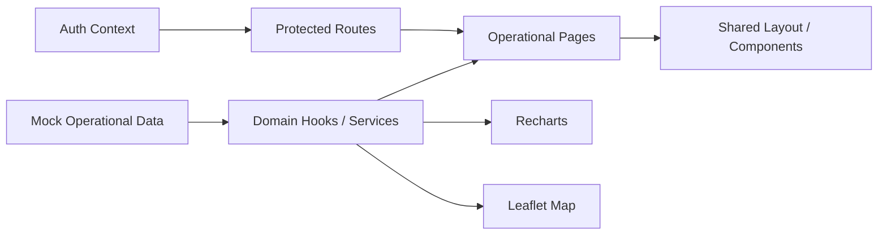

<div align="center">

# FleetMine

### Mining Fleet Operations Dashboard

**Telemetry · Geospatial Monitoring · Alerts · Incidents · Maintenance**

</div>

---

## Overview

**FleetMine** is a front-end control-center prototype for mining fleet operations.

It brings vehicle status, map-based monitoring, telemetry, operational alerts, incidents, maintenance workflows and fleet-health indicators into a single React/TypeScript application.

> **Current scope:** portfolio/demo implementation using local mock operational data. No production mine backend is required to explore the product.

## Product Areas

- operational KPI dashboard
- fleet inventory
- vehicle detail views
- interactive fleet map
- telemetry trends
- alert monitoring
- incident workflows
- maintenance work orders
- reports
- users/settings
- protected application routes

## Architecture



The data layer is intentionally replaceable: the current hooks/services can later be backed by a real telemetry or fleet-management API without redesigning the UI structure.

## Tech Stack

| Area | Technologies |
|---|---|
| Framework | React 19 · TypeScript |
| Build | Vite |
| Routing | React Router |
| Maps | Leaflet · React Leaflet |
| Charts | Recharts |
| Icons | Lucide React |
| Quality | ESLint |

## Repository Structure

```text
src/
├── auth/          authentication context, redirect flow and protected routes
├── components/    reusable UI, layout, KPI, chart and map components
├── data/          mock operational data
├── hooks/         domain-facing data hooks
├── pages/         dashboard, vehicles, alerts, incidents, maintenance, reports...
├── services/      API/service boundary
├── types.ts       shared domain types
└── utils/         formatting and shared helpers
```

## Run Locally

```bash
git clone https://github.com/KevinT31/FleetMine.git
cd FleetMine
npm install
npm run dev
```

### Quality checks

```bash
npm run lint
npm run build
```

## Engineering Focus

### Domain-oriented UI
The app is organized around mining operations rather than generic dashboard widgets.

### Geospatial operations
Leaflet is used as an operational surface for vehicle visibility, not just as a decorative map.

### Replaceable data boundary
Mock data is isolated from the presentation layer so the UI can evolve independently from a production telemetry backend.

### Reusable components
Shared KPI cards, status badges, chart components, layouts and page headers reduce duplicated page logic.

## Limitations

- telemetry is simulated/local
- authentication is a demo flow, not a production identity platform
- no live dispatch/mining backend is connected
- predictive maintenance is represented as product workflow, not a deployed ML service

---

### What this project demonstrates

**React/TypeScript engineering · industrial dashboard UX · maps · data visualization · operational domain modeling**
